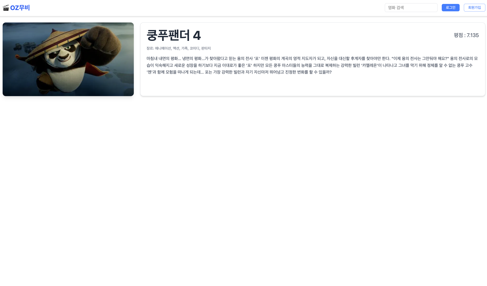

[mission-1] 1단계 미션 구현 - 최용훈/2팀

## 구현 사항

- MovieCard 컴포넌트로 영화 목록 렌터링
- 더미데이터로 MovieDetail 상세페이지 구현
- react-router-dom으로 라우팅
- NavBar 컴포넌트로 상단바 표시

## 어려웠던 점

- Outlet 사용법을 잊어 버려서 컴색하여 적용 함
- Router 적용방법이 익숙하지 않았음

## 구현 이미지

